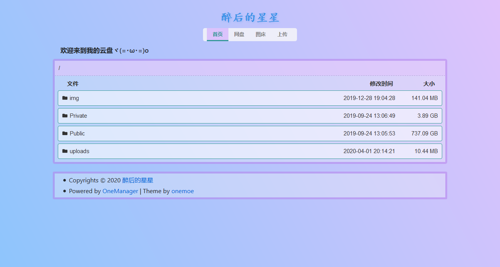
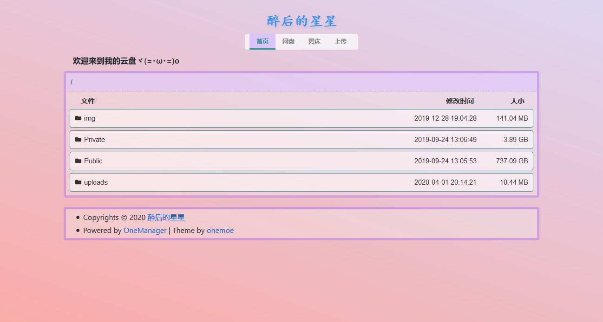
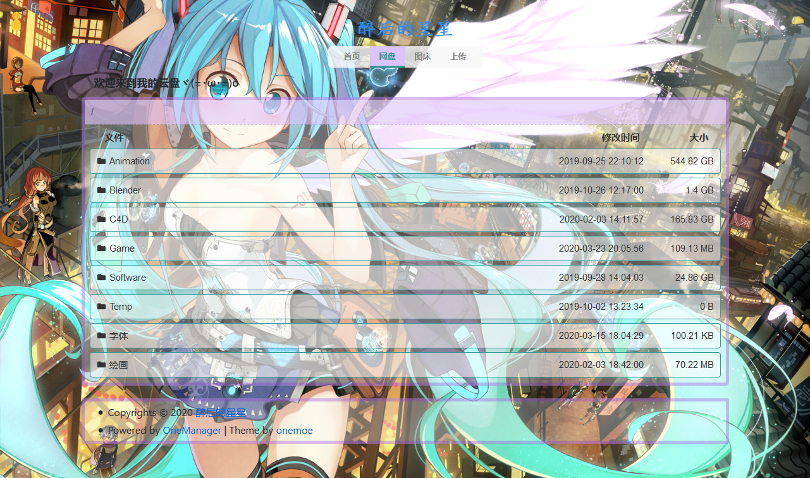
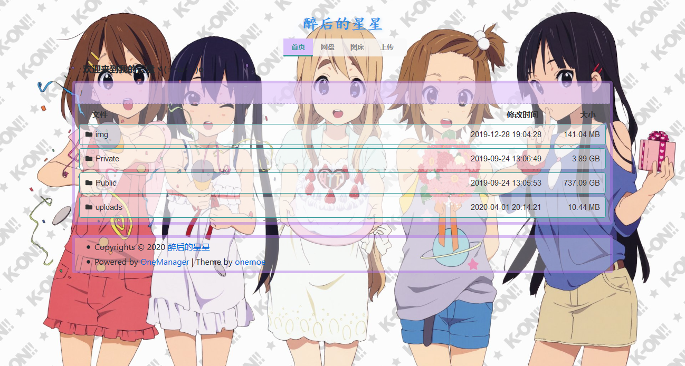
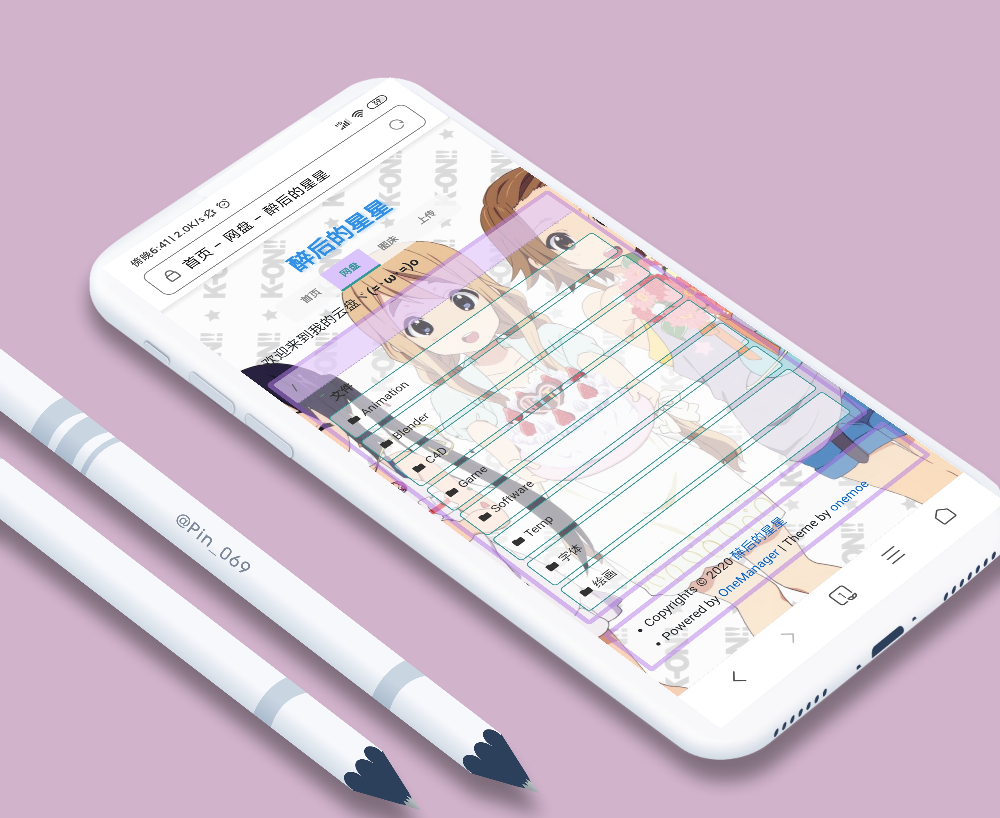

## 说明

这是 onedrive 云盘程序[OneManager](https://github.com/qkqpttgf/OneManager-php)的一个 CSS 美化 主题。

## 使用

- OneManager 程序已内置本主题，后台启用 onemoe 主题即可，或者可以通过设置 customTheme 链接来使用最新版本。

```html
https://cdn.jsdelivr.net/gh/kizx/onemoe-theme/onemoe.html
```

- 主题可以显示图片背景或者渐变色背景，要显示渐变色背景需要在后台清除背景图片设置，否则优先显示图片背景。

- 可以自定义背景渐近色，在后台 customCss 添加类似下面的代码即可，代码中的渐近色可以自行替换。只要你会点 css，主题中的任何颜色都可以通过该设置来改变。

```css
/* 简单点的像下面这样 */
<style>body{background-image: linear-gradient(to right, #868f96 0%, #596164 100%);}</style>
/* 复杂点的像下面这样 */
<style>
body {
  background: linear-gradient(to bottom, rgba(255, 255, 255, 0.15) 0%, rgba(0, 0, 0, 0.15) 100%), radial-gradient(at top center, rgba(255, 255, 255, 0.40) 0%, rgba(0, 0, 0, 0.40) 120%) #989898;
  background-blend-mode: multiply, multiply;
}
</style>
```

> 什么？你不会渐近色代码？放心，我也不会，只需要从类似下面的一些渐近色配色网站 copy css 然后粘贴过来即可。  
> 配色网站 1：https://www.grabient.com/  
> 配色网站 2：https://gradient.shapefactory.co/  
> 配色网站 3：https://webgradients.com/

- 更多细节请访问 [我的博客](https://www.2bboy.com/archives/154.html)。

## 预览

- [**在线预览**](https://pan.2bboy.com/Public)











